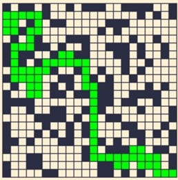
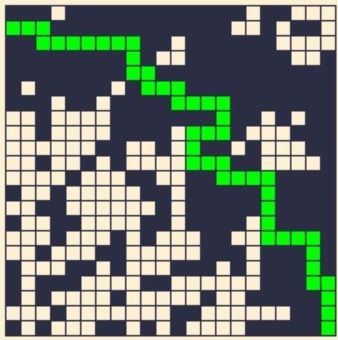
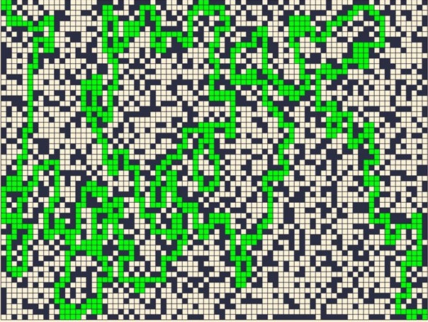

# Faculdade

<h3>Analisando os diferentes tempo de resolução seja do algoritmo BruteForce ou A* houve pouca diferença, seja pelo tamanho da grade ou pela baixa resolução do tempo de leitura. </h3>

<h4>Bruteforce</h4>

  <strong>Tempo de execução do resolvedor: 0.001000 segundos</strong>

  

  <strong>Tempo de execução do resolvedor: 0.001000 segundos</strong>

  

<h4>A*</h4>

  <strong>Tempo para resolver o labirinto: 0.0010 segundos.</strong>

  

  <strong>Tempo para resolver o labirinto: 0.0000 segundos.</strong>

  

<h4>BruteForce 60x80:</h4>

  <strong>Tempo para resolver o labirinto: 0.002995 segundos</strong>

  

<h4>A* 60x80:</h4>

  <strong>Tempo de execução do resolvedor: 0.002996 segundos</strong>

  

